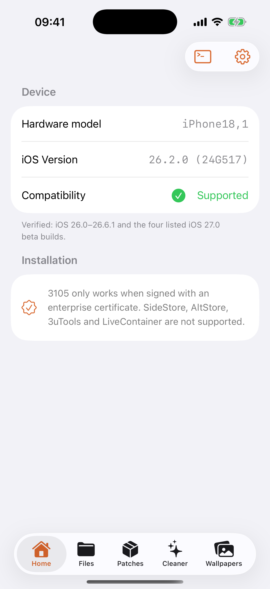

# Ragex

<p align="center">
  
</p>

<p align="center">
  <strong>iOS App Container Management & Portable Patching System</strong>
</p>

<p align="center">
  
  
  
  
</p>

---

> [!WARNING]
> **Ragex is research software for personal device management.**  
> - Only use on devices and data you own
> - Always maintain backups before modifying app data
> - Requires enterprise certificate signing for device functionality
> - Uses device exploits for container access (not a jailbreak)

---

## 📖 What is Ragex?

**Ragex** (formerly "X"/"3105") is a native iOS application that provides low-level access to app container directories, portable patch management, limited cleanup utilities, and PosterBoard wallpaper installation—all without requiring a traditional jailbreak.

The app leverages iOS vulnerabilities to access app containers via the MobileHouseArrest-C2 (MHA-C2) protocol, enabling file-level operations on installed applications while maintaining system stability.

---

## ✨ Key Features

### 🗂️ **App Data Browser**
- Browse app containers using stable **bundle identifiers** (not volatile UUIDs)
- Native file workspace with full directory navigation
- Independent from container ID changes between devices

### 📁 **Advanced File Operations**
- Search, preview, share, and import multiple files
- Copy, move, paste, rename, delete operations
- Create files and folders with conflict resolution
- ZIP archive creation and extraction with validation
- Multi-selection support across operations

### 🎯 **Portable Patch System (`.3105` / `.xpatch`)**
- Bundle-based patch packages that survive device migrations
- **Preinstalled patches** — ship patches directly inside the IPA
- Optional password protection for sensitive patches
- Rule-based file/folder modifications
- Import from Files app or secure web links
- Workspace v2: Build patches as directory trees under `On My iPhone/X/Patches`
- Safe restoration: Original files are journaled before writes

### 🧹 **Limited Cleaner**
- Scans only `Library/Caches` and `tmp` directories per app
- Displays recoverable space with sorting options
- Bulk selection with confirmation before deletion
- Does not touch system files or app data

### 🎨 **Wallpaper Lab**
- Import `.tendies` packages
- Payload validation before installation
- Tracks installed items with receipts
- Safe reset of only X-installed content
- PosterBoard activation guidance

### 🌐 **Localization**
- English
- Vietnamese (Tiếng Việt)
- Simplified Chinese (简体中文)

---

## 📱 Preview

<p align="center">
  
  &nbsp;
  
  &nbsp;
  
</p>

---

## 🔧 Compatibility

Ragex requires **verified iOS builds** for device-level features:

| iOS Version | Supported Range | Exploit Method |
|------------|-----------------|----------------|
| **iOS 17** | 17.0 – 17.7.x | Kernel exploit (opt-in) |
| **iOS 18** | 18.0 – 18.7.1 | Kernel exploit (opt-in) |
| **iOS 26** | 26.0 – 26.6.1 | MHA-C2 container access |
| **iOS 27 Beta** | Dev Beta 1–4 / Public Beta 1–2 | MHA-C2 container access |

**Notes:**
- Unlisted iOS 27 builds are marked unsupported until explicitly verified
- iOS 17–18 kernel exploit is **manual button only** (failed attempts may restart the app)
- Enterprise certificate signing is **required** for device functionality

---

## 📦 Preinstalled Patches

Ragex supports **bundling `.xpatch` patches directly into the IPA**, so users see patches immediately after installation.

### How to Add Preinstalled Patches:

1. Place your `.xpatch` files in:
   ```
   ThreeOneOSFive/PreinstalledPatches/
   ```

2. Add them to the Xcode project target

3. Build the IPA — patches will be automatically copied on first launch

**Example:**
```
ThreeOneOSFive/PreinstalledPatches/
├── GameMod.xpatch
├── UITweak.xpatch
└── CustomTheme.xpatch
```

When users install the IPA and open the app, patches appear in the **Patches** tab immediately. See [PREINSTALLED_PATCHES.md](PREINSTALLED_PATCHES.md) for details.

---

## 🛠️ Installation

### Requirements:
- **macOS** with Xcode 14+ (for building)
- **iOS device** running a supported iOS version
- **Enterprise certificate** for device functionality
- **Not supported:** SideStore, AltStore, 3uTools, LiveContainer

### Build from Source:

```bash
# Clone the repository
git clone https://github.com/bnxyung7/Ragex.git
cd Ragex

# Open in Xcode
open ThreeOneOSFive.xcodeproj

# Configure signing with your enterprise certificate
# Build scheme: X
# Target bundle ID: com.apple.mobile.MobileHouseArrest (do not change)

# Build for device
xcodebuild -project ThreeOneOSFive.xcodeproj \
  -scheme X \
  -configuration Release \
  -destination "generic/platform=iOS"
```

### Important Notes:
- The bundle identifier **must remain** `com.apple.mobile.MobileHouseArrest` for MHA-C2 functionality
- Source code does **not** include certificates, provisioning profiles, or signed IPAs
- Enterprise signing is mandatory for device-level operations

---

## 📂 Project Structure

```
Ragex/
├── ThreeOneOSFive/              # Main application source
│   ├── App.swift                # App entry point with preinstalled patches
│   ├── ContentView.swift        # Main UI layout
│   ├── Assets.xcassets/         # App icons and assets
│   ├── en.lproj/                # Localization files
│   ├── exploit/                 # Kernel exploit implementation
│   │   ├── bad_query.c/h        # iOS exploit primitives
│   │   ├── mcm_bridge.m/h       # MCM bridge for container access
│   │   └── wallpaper_zip.c/h    # Wallpaper ZIP handling
│   ├── kexploit/                # Kernel read/write exploit
│   │   ├── kexploit_opa334.m/h  # Kernel exploit (opa334)
│   │   ├── krw.m/h              # Kernel R/W primitives
│   │   └── kutils.m/h           # Kernel utilities
│   ├── helpers/                 # Core services and utilities
│   │   ├── PatchProjectStore.swift
│   │   ├── PreinstalledPatchLoader.swift
│   │   ├── FileManagerService.swift
│   │   ├── DevicePatchService.swift
│   │   ├── CleanerCatalog.swift
│   │   ├── WallpaperLabService.swift
│   │   └── ...                  # 40+ helper modules
│   ├── PreinstalledPatches/     # Folder for bundled patches
│   ├── views/                   # SwiftUI views
│   └── Info.plist               # App configuration
├── ThreeOneOSFive.xcodeproj     # Xcode project
├── docs/                        # Documentation and images
│   ├── images/                  # Screenshots and icons
│   └── PATCH_GUIDE.md           # Patch creation guide
├── CHANGELOG.md                 # Version history
├── LICENSE                      # GPL v3.0 License
├── PREINSTALLED_PATCHES.md      # Preinstalled patch guide
├── THIRD_PARTY_NOTICES.md       # Third-party attributions
└── README.md                    # This file
```

---

## 🚀 What's New in v1.1.1

### Broader iOS Support
- Verified support for **iOS 17.0–17.7.x** (kernel exploit)
- Verified support for **iOS 18.0–18.7.1** (kernel exploit)
- Full compatibility with **iOS 26.0–26.6.1**
- Tested on **iOS 27 Developer Beta 1–4** and **Public Beta 1–2**

### Enhanced Patch System
- **Preinstalled patches** — bundle `.xpatch` files directly in the IPA
- Wrong-password feedback for encrypted patches
- Improved onboarding for reinstalls and overwrite scenarios

### Patch Workspace v2
- Build patches as directory trees under `On My iPhone/X/Patches`
- Automatic synchronization on Apply/Export
- Journaled file backups for safe restoration
- Original files restored, patch-introduced files removed

See [CHANGELOG.md](CHANGELOG.md) for complete version history.

---

## 📚 Documentation

- **[Patch Creation Guide](docs/PATCH_GUIDE.md)** — How to create and use `.3105` patches
- **[Preinstalled Patches Guide](PREINSTALLED_PATCHES.md)** — Bundle patches in your IPA
- **[Changelog](CHANGELOG.md)** — Complete version history
- **[Third-Party Notices](THIRD_PARTY_NOTICES.md)** — Open source attributions

---

## 🔒 Security & Responsible Use

- **Do not publish** logs, app containers, cookies, account databases, or patch payloads containing personal data
- **Report security issues** privately to the maintainer
- This software is for **personal device management only**
- Using exploits carries inherent risks — always maintain backups

---

## ⚠️ Important Disclaimers

- **Not a jailbreak:** Ragex does not install a persistent jailbreak, bootstrap, or daemon
- **No code injection:** Does not inject code into third-party apps
- **Exploit-based:** Uses device vulnerabilities for container access
- **Detection risk:** Cannot guarantee bypass of all app integrity checks or jailbreak detection
- **Enterprise signing required:** Device functionality requires enterprise certificate signing
- **Use at your own risk:** Modifying app data may cause instability or data loss

---

## 📜 License

Ragex is distributed under the [GNU General Public License v3.0](LICENSE).

Third-party components remain subject to their respective upstream licenses. See [THIRD_PARTY_NOTICES.md](THIRD_PARTY_NOTICES.md) for details.

---

## 🤝 Contributing

This is a research project. Contributions, bug reports, and feature requests are welcome via GitHub Issues and Pull Requests.

---

## 📞 Contact

- **Repository:** [github.com/bnxyung7/Ragex](https://github.com/bnxyung7/Ragex)
- **Developer:** bnxyung7

---

<p align="center">
  <sub>Built with Swift and SwiftUI for iOS research and personal device management.</sub>
</p>
